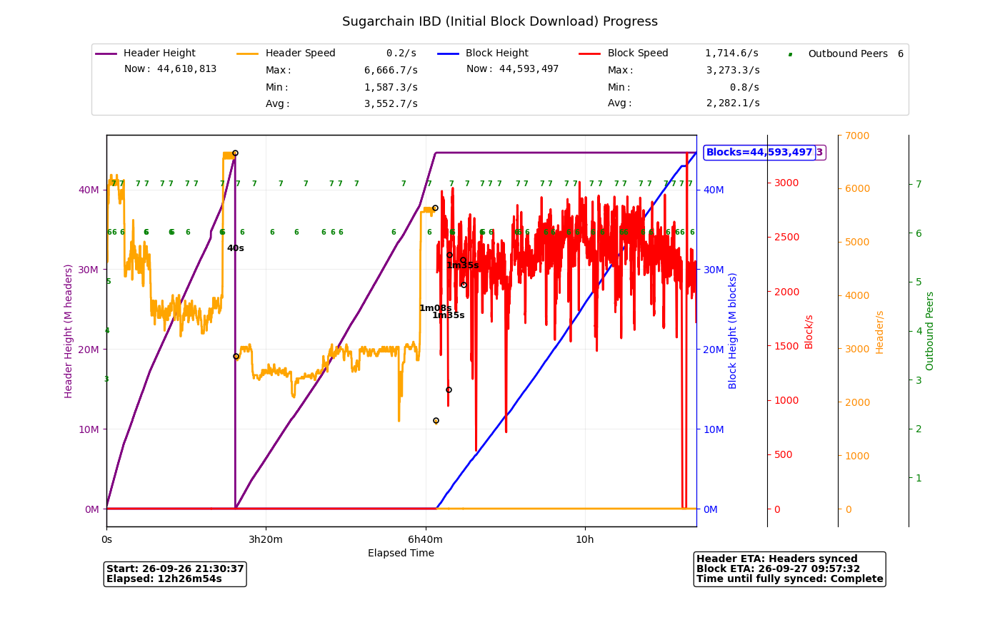

# IBD Monitor

Monitor header and block synchronization using existing node RPC responses and `debug.log`.
Supports Sugarchain/Visioneye checkpoint progress and Bitcoin Core 31 / Sugarchain Komorebi Core31 header sync and presync logs.



See how synchronization progresses at a glance: header and block heights, processing speeds, connected outbound peers, elapsed time and estimated time remaining. The image above shows an example Sugarchain run.

## Requirements

- Linux (CLI auto-discovery uses `/proc`; collector locking uses `fcntl`).
- Python 3.10+, NumPy and Matplotlib.
- `feh` and a graphical desktop for the live image viewer.
- A running node and its matching command-line client, with local RPC access.

On Ubuntu 22.04:

```bash
sudo apt install python3-numpy python3-matplotlib feh
```

Keep `graph.sh`, `ibd_connection.py` and `ibd_progress.py` together. Despite its filename, `graph.sh` is a Python program. `ibd_test.sh` is not required.

## Run

Use an existing node datadir and create a separate output directory:

```bash
mkdir -p "$HOME/ibd-monitor-output/node-a"
IBD_DATADIR="$HOME/.sugarchain" \
IBD_OUTPUT_DIR="$HOME/ibd-monitor-output/node-a" \
./graph.sh --reload 3
```

For Bitcoin, set `IBD_DATADIR="$HOME/.bitcoin"`. To watch two nodes, run the command in separate terminals with different datadirs and output directories.

The matching running node's sibling CLI is discovered automatically. If needed, explicitly set `IBD_CLI=/path/to/sugarchain-cli` or `IBD_CLI=/path/to/bitcoin-cli`. The CLI reads its normal config and RPC cookie. `IBD_CONF` and `IBD_RPC_PORT` are available for overrides.

The existing collector samples RPC every five seconds. `--reload 3` refreshes the graph every three seconds; it does not change the sampling interval. Initially the graph waits for sufficient samples. Core31 presync uses timestamped log entries; observations begin with the collected session rather than reconstructing an entire prior IBD.

Files:

- `ibd_rpc.csv` and its monitor lock: in the datadir by default; override with `IBD_CSV`.
- Graph images and `graph2_monitor.log`: in `IBD_OUTPUT_DIR`, which must exist. The default output directory is the script directory.
- `debug.log`: resolved from the selected datadir/network; override with `IBD_DEBUG_LOG`.

The script does not start, stop or restart the node. It does start a separate collector. Closing the reload viewer/loop does not necessarily stop that collector.

## Terminal monitor

For text output without a graph or CSV collector, keep `ibd_test.sh`,
`ibd_terminal_progress.py`, `ibd_progress.py` and `ibd_connection.py` together.
Install `jq` in addition to Bash and Python 3.10+:

```bash
sudo apt install jq
IBD_DATADIR="$HOME/.sugarchain" ./ibd_test.sh
```

The terminal uses the same CLI discovery/configuration overrides described above.
It reads the selected `debug.log` incrementally and displays Core31 presync and
replay heights/rates even while RPC `headers` is zero. Visioneye progress remains
supported. Rates use the existing log timestamp window; the first sample and
each phase/session transition need two distinct timestamps before a rate exists.
Block speed and peer count retain the five-second terminal sampling behavior.

Example `ibd_test.sh` output during header presync, before block download starts:

```text
Header Height=1196000 / Header Speed=1566.67/s / Block Height=0 / Block Speed=0/s / Outbound Peers=9
Header Height=1204000 / Header Speed=1566.67/s / Block Height=0 / Block Speed=0/s / Outbound Peers=9
Header Height=1212000 / Header Speed=1533.33/s / Block Height=0 / Block Speed=0/s / Outbound Peers=9
Header Height=1218000 / Header Speed=1533.33/s / Block Height=0 / Block Speed=0/s / Outbound Peers=9
Header Height=1226000 / Header Speed=1500/s / Block Height=0 / Block Speed=0/s / Outbound Peers=9
Header Height=1234000 / Header Speed=1500/s / Block Height=0 / Block Speed=0/s / Outbound Peers=9
Header Height=1240000 / Header Speed=1475.41/s / Block Height=0 / Block Speed=0/s / Outbound Peers=9
Header Height=1248000 / Header Speed=1500/s / Block Height=0 / Block Speed=0/s / Outbound Peers=9
Header Height=1256000 / Header Speed=1500/s / Block Height=0 / Block Speed=0/s / Outbound Peers=9
Header Height=1264000 / Header Speed=1466.67/s / Block Height=0 / Block Speed=0/s / Outbound Peers=9
Header Height=1272000 / Header Speed=1466.67/s / Block Height=0 / Block Speed=0/s / Outbound Peers=9
Header Height=1280000 / Header Speed=1466.67/s / Block Height=0 / Block Speed=0/s / Outbound Peers=9
Header Height=1288000 / Header Speed=1466.67/s / Block Height=0 / Block Speed=0/s / Outbound Peers=9
Header Height=1296000 / Header Speed=1466.67/s / Block Height=0 / Block Speed=0/s / Outbound Peers=9
Header Height=1304000 / Header Speed=1500/s / Block Height=0 / Block Speed=0/s / Outbound Peers=9
Header Height=1312000 / Header Speed=1500/s / Block Height=0 / Block Speed=0/s / Outbound Peers=9
Header Height=1318000 / Header Speed=1500/s / Block Height=0 / Block Speed=0/s / Outbound Peers=9
```

Output is also written to the next unused `ibd_test_N.txt` in the script
directory; set `IBD_LOGDIR` to an existing directory to change this location.
Ctrl+C stops the terminal and its own log reader. The terminal does not execute
`graph.sh`, start/restart a graph collector, or modify graph CSVs. Its Core31
presync adapter is separate from the shared graph parser.

Run the offline terminal regression tests with:

```bash
python3 -m unittest -v test_ibd_terminal
```

## Metrics

Graphs include header/block heights and speeds, outbound peer count, elapsed time and ETA estimates. Block speed uses the existing 60-second rolling window. Block Min/Max/Avg use positive, complete measurement windows after observed block processing begins; startup partial windows are excluded. Header statistics have their existing log/RPC handling and are not defined identically to block statistics.

Generated CSV files, images, logs, node configuration and authentication files are not part of this repository. The source retains a legacy local-test fallback using port `11324` and literal placeholder credentials `rpcuser` / `rpcpassword`; normal node config/cookie discovery takes precedence.
